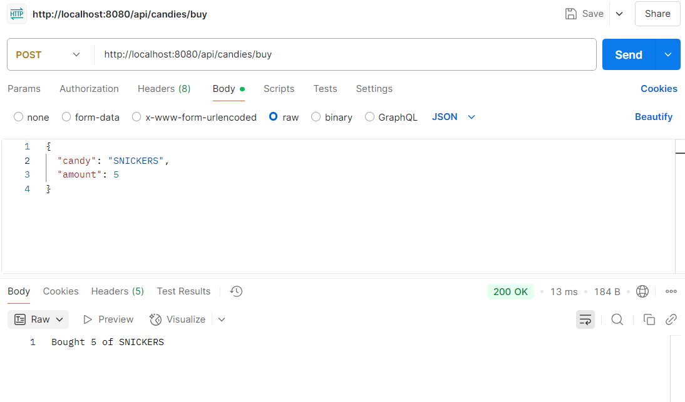
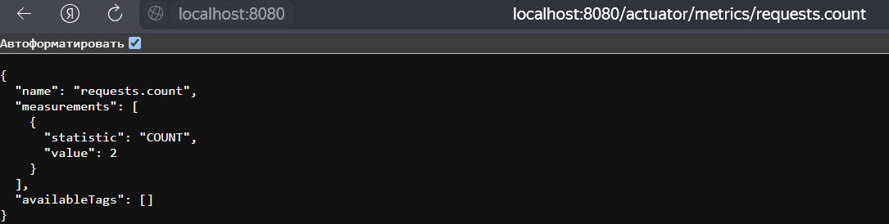
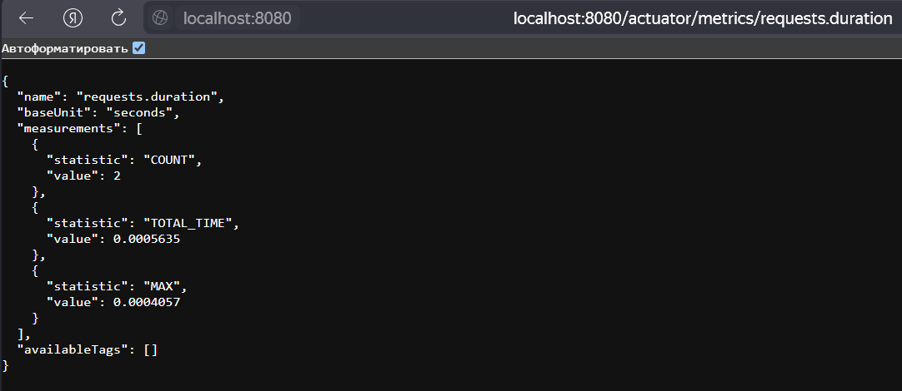
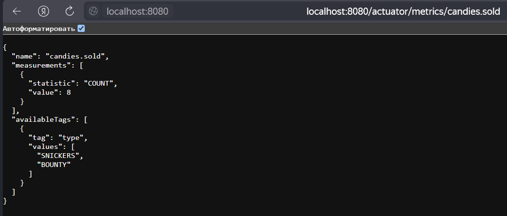
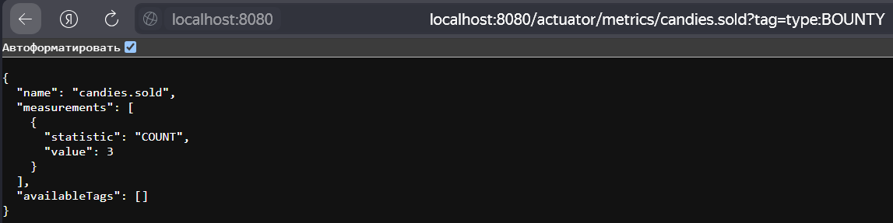
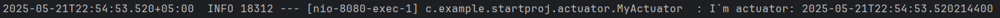
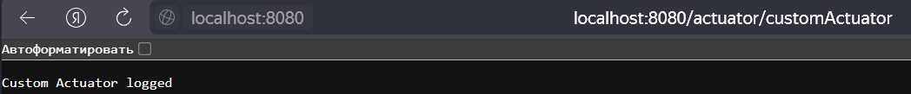

**Преподаватель:** Иванов Никита  
**Студент:** Есипов Илья

# Что я сделал в задании:
1) Создал простенькое веб приложение, которое отдаёт следующие метрики:
   -  количество запросов.
   -  время выполнения запроса.
   -  мою метрику по подсчету результатов выборки (кол-во купленных конфут/шоколадок)
   -  создал свой актуатор. 
2) Скриншоты:
    - 
    - 
    - 
    - 
    - 
    - 
    - 