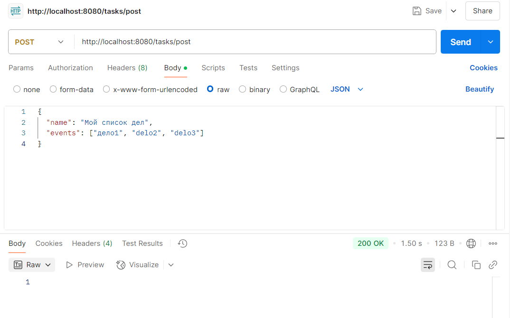
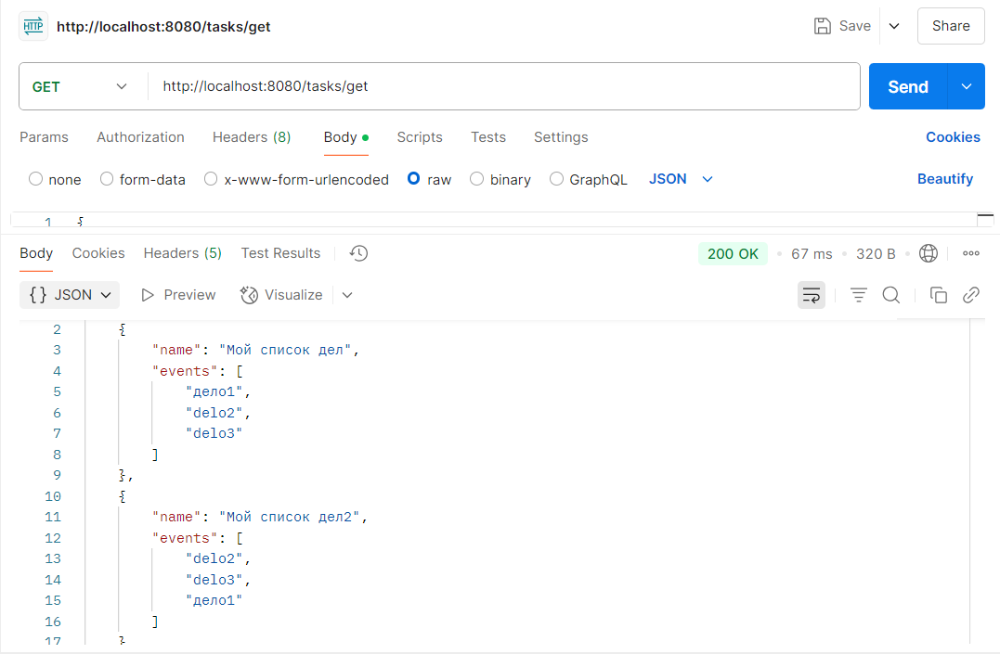

**Преподаватель:** Иванов Никита  
**Студент:** Есипов Илья

# Что я сделал в задании:
1) Подключил свою бд Postgres
2) Создал контроллер с двумя endpoint (**postTask()** и **getTask()**)
3) Написал две таблицы для бд TaskEntity и EventEntity.    

Тут появился вопрос: я создал две таблицы, но, по идее, можно было бы ещё сразу в TaskEntity создавать вспомогательную таблицу для events(для их удобного хранения). Ещё можно было бы set преобразовывать в строку, когда добавляем, и обратно в set, когда достаём. Получается три варианта. Я подумал, что первый вариант самый лучший и удобный, но так ли это? Потому что мне ещё очень нравится второй вариант с вспомогательной таблицей(например через CollectionTable).
4) Написал три бина точно по заданию:
   - Добавление в базу данных.
     
   - Получение данных с базы данных.
     