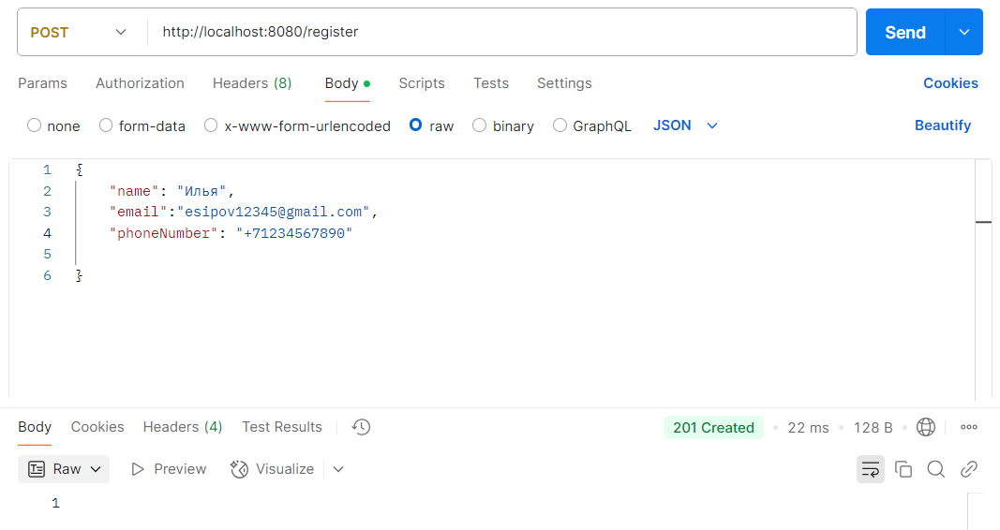
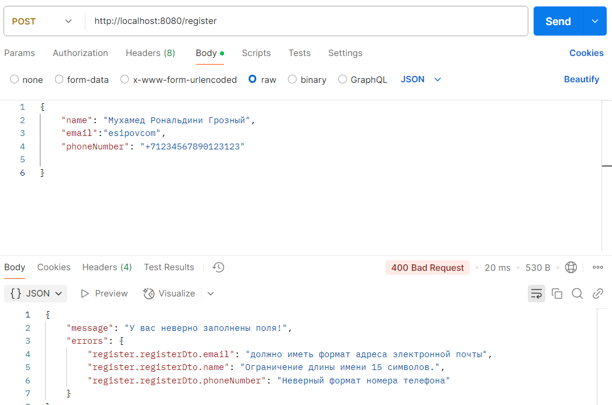

**Преподаватель:** Иванов Никита  
**Студент:** Есипов Илья

# Что я сделал в задании:
1) Сделал свою аннотацию(**@PhoneNumber**) и кастомный валидатор к ней (**@PhoneNumberValidator**). При возникновении ошибки выдаётся красивый ответ(надеюсь это соответствует значению "красивый")))
2) Написал аннотацию для валидации **@ValidName**, объединяющую несколько аннотаций.
   
   
