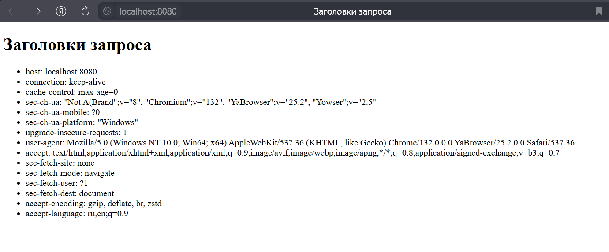
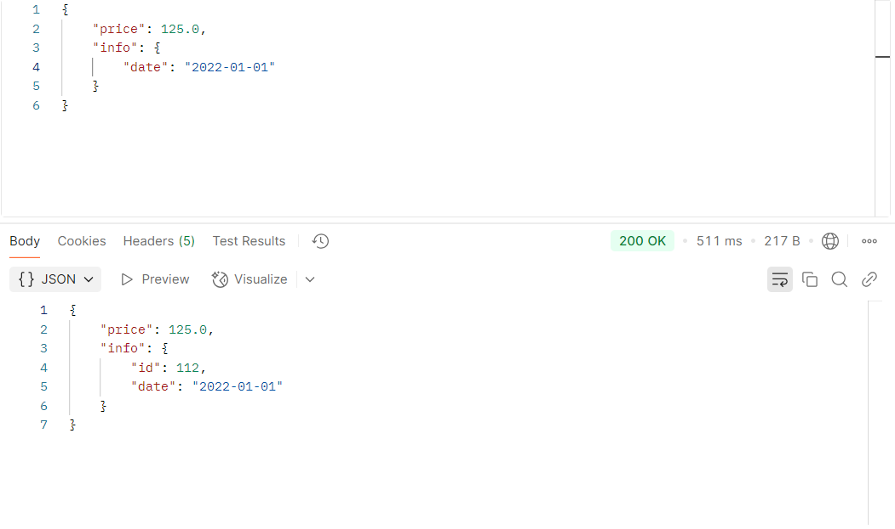
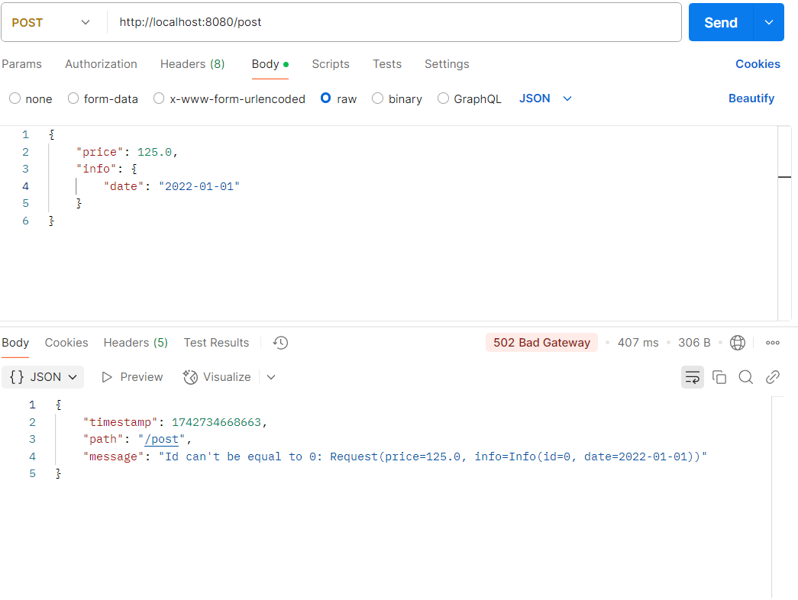

**Преподаватель:** Иванов Никита  
**Студент:** Есипов Илья

# WebApplicationContext
*-* это контекст, специализированный для обработки запросов веб-приложений.  

# Mappings:  
- ***@PostMapping*** - используется для обработки POST-запросов(добавление).  
- ***@GetMapping*** - используется для обработки GET-запросов(получение).  
- ***@PutMapping*** - используется для обработки PUT-запросов(полное изменение).  
- ***@DeleteMapping*** - используется для обработки DELETE-запросов(удаление).
- ***@PatchMapping*** - используется для обработки PATCH-запросов(частичное изменение).
- ***@RequestMapping*** - как я понял это универсальный Mapping.

# Параметры:  
- ***value/path*** - задаёт URL-адрес.
- ***method*** - указывает HTTP-метод у RequestMapping.
- ***params*** - ограничивает обработку по параметрам запроса.
- ***headers*** - ограничивает обработку по заголовкам.
- ***consumes*** - указывает формат данных, который принимает метод.
- ***produces*** - указывает формат данных, который метод возвращает.

# Что я сделал в задании:  
1) Прочитал про WebApplicationContext, мини-конспектик выше.
2) Реализовал два контроллера: HeaderController и JsonController. HeaderController в качестве ответа отдает шаблон, а JsonController принимает Json и отдаёт обратно тот же Json, но с добавленным полем id(я его просто генерирую через Random()).

3) Написал обработчик ошибок(BadGatewayExceptions и ExceptionsHandler), который возвращает кастомную ошибку.

***Ps: как-то так, надеюсь, что верно понял и выполнил задание.***

