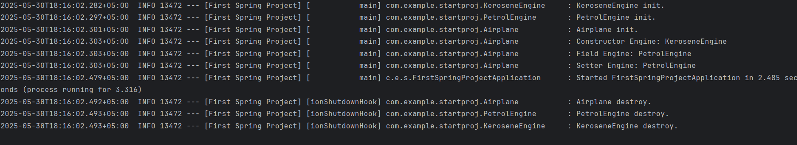

**Преподаватель:** Иванов Никита  
**Студент:** Есипов Илья

(Ps: Поправил ошибки, в том числе добавил README)
# Что я сделал в задании:
1) Реализовал приложение, в котором:   
   ●  используется DI через конструктор    
   ●  используется DI через поле    
   ●  используется DI через сеттеры    
   ●  создаются и внедряются два бина разных классов, но реализующих один интерфейс    
   ●  при создании и “разрушении” бина в лог выводится сообщение    
2) Скриншот:
      