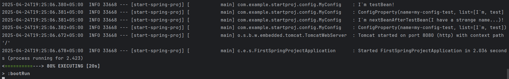
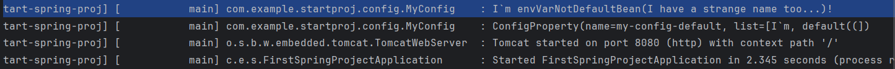

**Преподаватель:** Иванов Никита  
**Студент:** Есипов Илья

# Что я сделал в задании:
1) Создал три профиля( *application-dev.yaml*, *application-test.yaml*, *application-prod.yaml*).
2) Написал три бина точно по заданию: 
  - Если профиль test.
  - Если существует первый бин.
   
  - Если  EXAMPLE_TEST (env var) не “default”.
    